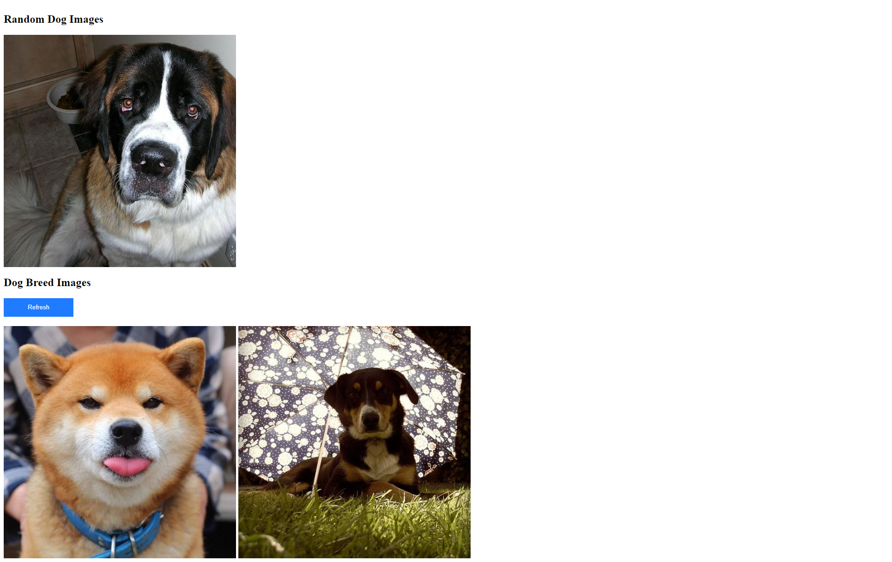

# Deliveristo Frontend Dashboard

This project is a web app that displays images of dogs based on different criteria, such as random images by breed, a list of images by breed, random images by breed and sub-breed, and a list of images by breed and sub-breed. The app is built using React.js and TypeScript, and it interacts with the [Dog API](https://dog.ceo/dog-api) to fetch dog-related data.



## Live Demo

You can view the live demo of this project [here](https://muhammadshiraz.github.io/deliveristo-frontend).

## Features

- Display random dog image by breed.
- Display a list of dog images by breed.
- Display random dog image by breed and sub-breed.
- Display a list of dog images by breed and sub-breed.
- Responsive layout for various screen sizes.
- Dockerized version available for easy deployment.

## Prerequisites

Before you begin, ensure you have met the following requirements:

- Node.js installed on your local machine
- npm or yarn package manager installed
- Docker (for running the Dockerized version)

## Installation and Setup

1. **Clone the repository:**

   ```bash
   git clone https://github.com/muhammadshiraz/deliveristo-frontend.git
   cd deliveristo-frontend
   ```

2. **Install dependencies:**

   ```bash
   npm install
   ```

3. **Run the development server:**

   ```bash
   npm start
   ```

   The app will be running at `http://localhost:3000`.

## Usage

- Click on the navigation links to view different categories of dog images.
- Click the "Refresh" button to load new random images.
- Enjoy exploring different dog breeds and sub-breeds!

## Dockerized Version

This project includes a Dockerfile for containerization. To run the app using Docker, follow these steps:

1. **Build the Docker image:**

   ```bash
   docker build -t deliveristo-frontend .
   ```

2. **Run the Docker container:**

   ```bash
   docker run -d -p 80:80 deliveristo-frontend
   ```

   The app will be accessible at `http://localhost`.

## Deployment to GitHub Pages

This project is set up for deployment to GitHub Pages. To deploy the app, follow these steps:

1. **Update `package.json` homepage field:**

   Update the `"homepage"` field in `package.json` to match your GitHub Pages URL.

   ```json
   {
     "homepage": "https://yourusername.github.io/deliveristo-frontend",
     // ...
   }
   ```

2. **Deploy to GitHub Pages:**

   ```bash
   npm run deploy
   ```

   The app will be deployed to GitHub Pages and will be accessible at the specified URL.

## Testing

This project includes unit tests and end-to-end tests. You can run the tests using the following commands:

- Run unit tests:

  ```bash
  npm test
  ```

- Run end-to-end tests:

  ```bash
  npm run test:e2e
  ```

## Technologies Used

- **React.js**: JavaScript library for building user interfaces.
- **TypeScript**: Superset of JavaScript that adds static types to the language.
- **Redux**: State management library for managing the app's state.
- **React Router**: Declarative routing for React.js applications.
- **Axios**: Promise-based HTTP client for making requests to the Dog API.
- **Jest and Testing Library**: Testing framework and utilities for writing unit and end-to-end tests.

## Folder Structure

The project structure is organized as follows:

- **`src/`**: Contains the source code files.
  - **`components/`**: Reusable React components.
  - **`containers/`**: Components that connect to Redux store.
  - **`services/`**: API service functions.
  - **`store/`**: Redux store setup (reducers, actions, etc.).
  - **`styles/`**: CSS and styling files.
  - **`utils/`**: Utility functions and helpers.
- **`public/`**: Static assets and HTML template.

## Contributing

If you'd like to contribute to this project, please follow these guidelines:

1. Fork the repository and clone it to your local machine.
2. Create a new branch for your feature or bug fix: `git checkout -b feature-name`.
3. Make your changes and commit them: `git commit -m 'Description of changes'`.
4. Push your changes to the branch: `git push origin feature-name`.
5. Create a pull request on GitHub.

## License

This project is licensed under the MIT License - see the [LICENSE](LICENSE) file for details.

---

Feel free to reach out if you have any questions or need further assistance. Happy coding!